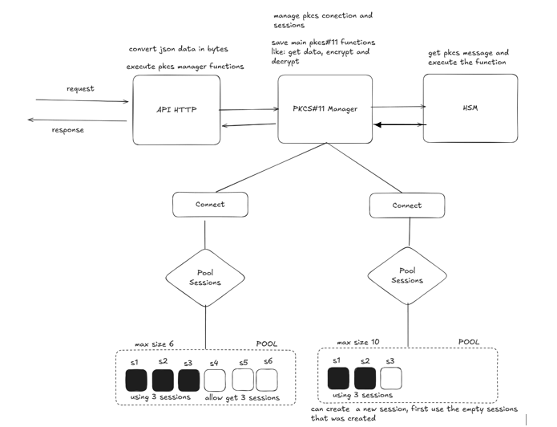
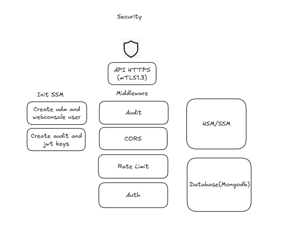
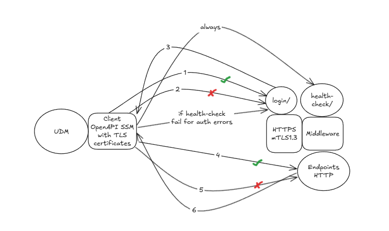
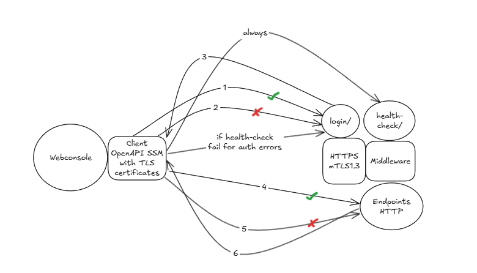
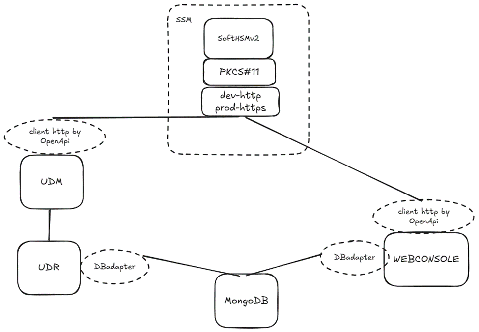

# Current SSM Operation


Figure 1: High-level diagram of SSM operation

Figure 1 shows a high-level diagram of SSM operation.

1- HTTP/HTTPS API: This API is written in Gin and with OpenAPI Generator, the Golang code is generated so that client applications can interact with the SSM.

2- PKCS11 Manager: The PKCS11 Manager is responsible for managing the PKCS#11 modules used to interact with security devices. It provides an interface to load and manage these modules. Operations such as module initialization, session management, and execution of PKCS#11 commands to encrypt, decrypt, sign, and verify data are performed here. Session pools are also managed here to optimize performance and naturally concurrent operations.

3- HSM: Component responsible for handling cryptographic operations securely. It can be a physical HSM or a virtual HSM as in our current case where SoftHSM has been used for testing and development. 


Figure 2: Illustrates the security components implemented in SSM

1- The SSM init section runs every time the SSM starts. It handles two fundamental tasks. First, the udm and webconsole users are created if they don't exist, these are stored in the database (passwords are encrypted with an AES256 key generated specifically for this process) and this sensitive data is exposed in a txt file at the path /tmp/user-secret-ssm/, which must be handled carefully. This data will be necessary to login to the Webconsole and UDM. Finally, asymmetric encryption keys are created for audit and logging processes; if these keys already exist, they are not recreated.

2- The next block is the main one, which provides security to the exposed HTTP API.

All API requests must provide the corresponding TLS certificates; if they are not valid certificates or none are provided, the connection will be rejected.

Clients must login with their credentials before performing operations; if valid, they will be provided with a JWT token that they must use in subsequent requests.

The audit process will always run on every API request and will save the information in the database, with a digital signature generated with the keys created in the SSM init.

In the auth step, the JWT token provided by the client will be verified; if valid, access to the requested resources will be allowed. Roles are verified here; if it's webconsole, access to all resources will be allowed; if it's udm, access will only be allowed to the resources permitted for this role, so far it only has permission to use the endpoint to decrypt secrets.

All processes involving encryption or digital signature will use the PKCS11 Manager to interact with the HSM and perform cryptographic operations securely.


Figure 3: Sequence diagram of a request to the SSM HTTP API by UDM


Figure 4: Sequence diagram of a request to the SSM HTTP API by Webconsole


Figure 5: Architecture of SSM integration with UDM and Webconsole

Ejemplo de archivo de configuración SSM (config.yml) con parámetros de seguridad:
```yml
# SSM Configuration File
info:
  version: "1.0.0"
  description: "Secure Storage Manager Service"

configuration:
  ssmName: "SSM"
  ssmId: "cafe00"
  socketPath: "/var/run/socket.so"
  pkcsPath: "/usr/lib/softhsm/libsofthsm2.so"
  pin: "1234"
  lotsNumber: 1121449042
  bindAddr: 0.0.0.0:9000
  exposeSwaggerUi: true
  isHttps: true
  certFile: server.crt 
  keyFile: server.key
  caFile: ca.crt
  maxSessions: 100
  isSecure: true             # Enable security middlewares (CORS, rate limiting, authentication)
  # MongoDB Database Configuration
  mongodb:
    name: "ssm_db"           # Database connection name identifier
    url: "mongodb://172.28.31.5:27017/?replicaSet=rs0"  # MongoDB connection string
    dbName: "secure_storage"   # Name of the database to use
  
  # Rate Limiting Configuration - Controls API request throttling per client IP
  rateLimit:
    enabled: true              # Enable/disable rate limiting functionality
    requestsPerMin: 60         # Maximum number of requests allowed per minute per IP address
    burstSize: 10              # Allow temporary burst of additional requests beyond the limit
    cleanupInterval: 15        # Interval in minutes to cleanup inactive client tracking data

  # Cross-Origin Resource Sharing (CORS) Configuration - Controls browser access from different domains
  cors:
    allowAllOrigins: false     # Allow requests from any origin (overrides allowOrigins if true)
    allowOrigins:              # List of specific origins allowed to access the API
      - "https://localhost:3000"
      - "https://app.example.com"
    allowMethods:              # HTTP methods permitted in cross-origin requests
      - "GET"
      - "POST" 
      - "PUT"
      - "PATCH"
      - "DELETE"
      - "HEAD"
      - "OPTIONS"
    allowPrivateNetwork: false # Enable Private Network Access for local network requests
    allowHeaders:              # Headers that can be used in actual requests
      - "Origin"
      - "Content-Length"
      - "Content-Type"
      - "Authorization"
      - "X-Requested-With"
    allowCredentials: true     # Allow cookies and HTTP authentication in cross-origin requests
    exposeHeaders:             # Headers exposed to the browser in responses
      - "Content-Length"
      - "X-RateLimit-Limit"
      - "X-RateLimit-Remaining" 
      - "X-RateLimit-Reset"
    maxAge: 43200              # Cache time for preflight requests in seconds (12 hours)
    allowWildcard: false       # Enable wildcard matching in origins (e.g., https://*.example.com)
    allowBrowserExtensions: false  # Allow browser extension schemes (chrome-extension://, etc.)
    customSchemas: []          # Additional URI schemes to allow (e.g., ["tauri://"])
    allowWebSockets: false     # Allow WebSocket origins (ws:// and wss://)
    allowFiles: false          # Allow file:// origins (security risk - use cautiously)
    optionsResponseStatusCode: 204  # HTTP status code returned for OPTIONS preflight requests

logger:
  SSM:
    debugLevel: debug         # debug, info, warn, error

```